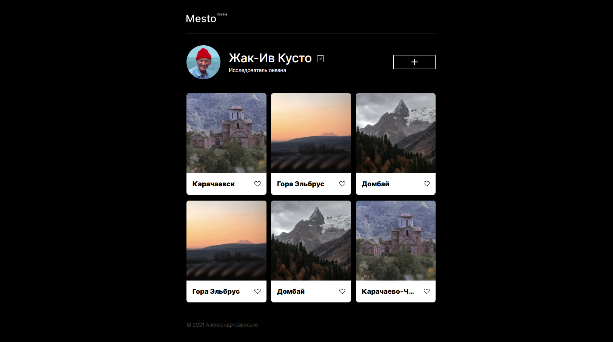

# Проект: Место
Проект создан в рамках курса - Yandex.Practicum. 

**Ссылка на Github-pages**

* [steanull.github.io/mesto-project/](https://steanull.github.io/mesto-project/)

**Используемые технологии**
* Flexbox
* Grid
* Медиазапросы
* БЭМ
